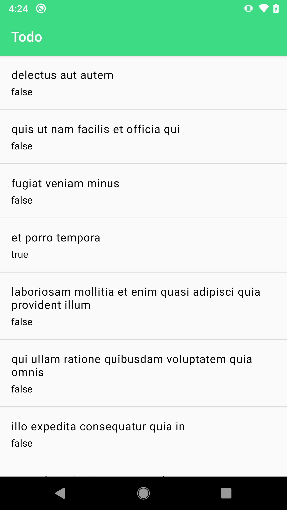

# Restaurant Finder

## Functional spec :
Write a simple application presenting list of todos.

1. The list should be taken from given source: https://jsonplaceholder.typicode.com/todos
2. List should be stored in device database and accessible afterwards, even when device is offline
3. List item should present Todo.title and Todo.status

## Suggestions:
1. Write clean, readable and well structured code
2. There is no preferred language, technique or technology. It's an open task
3. Task should not take more than 2 hours
4. Example test cases are and reactive solutions are a plus
5. Short summary of applied solutions warmly welcome

## Design partner :
[MVVM](https://en.wikipedia.org/wiki/Model%E2%80%93view%E2%80%93viewmodel)

## Library
1. [APPCOMPAT ](https://developer.android.com/jetpack/androidx/releases/appcompat)
2. [MATERIAL](https://material.io/develop/android/docs/getting-started/)
3. [CALLIGRAPHY ](https://github.com/chrisjenx/Calligraphy)
4. [ARCHITECTURE COMPONENTS](https://developer.android.com/topic/libraries/architecture)
5. [RETROFIT](https://github.com/square/retrofit)
6. [RETROFIT_MOSHI_CONVERTER ](https://github.com/square/retrofit/tree/master/retrofit-converters/moshi)
7. [STETHO ](https://github.com/facebook/stetho)
8. [TIMBER ](https://github.com/JakeWharton/timber)
9. [DAGGER](https://github.com/google/dagger)
10. [LEAK_CANNARY](https://github.com/square/leakcanary)
10. [ROOM](https://developer.android.com/training/data-storage/room)

## Screenshot

  

